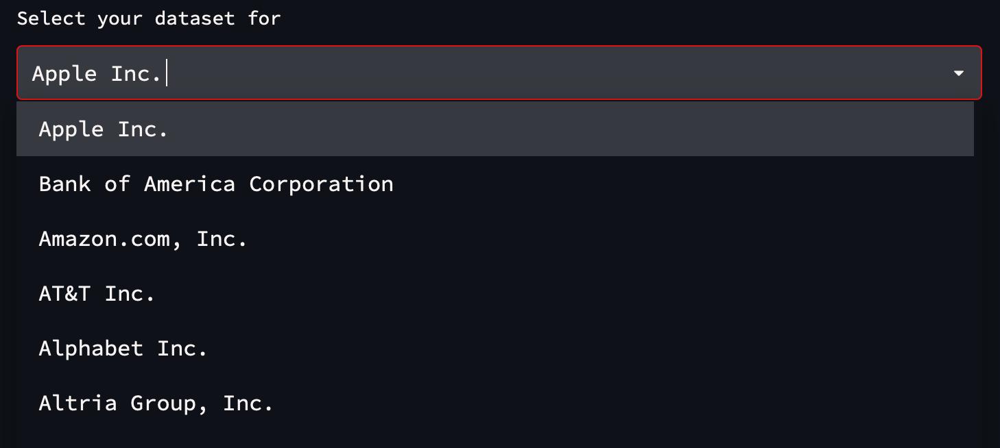
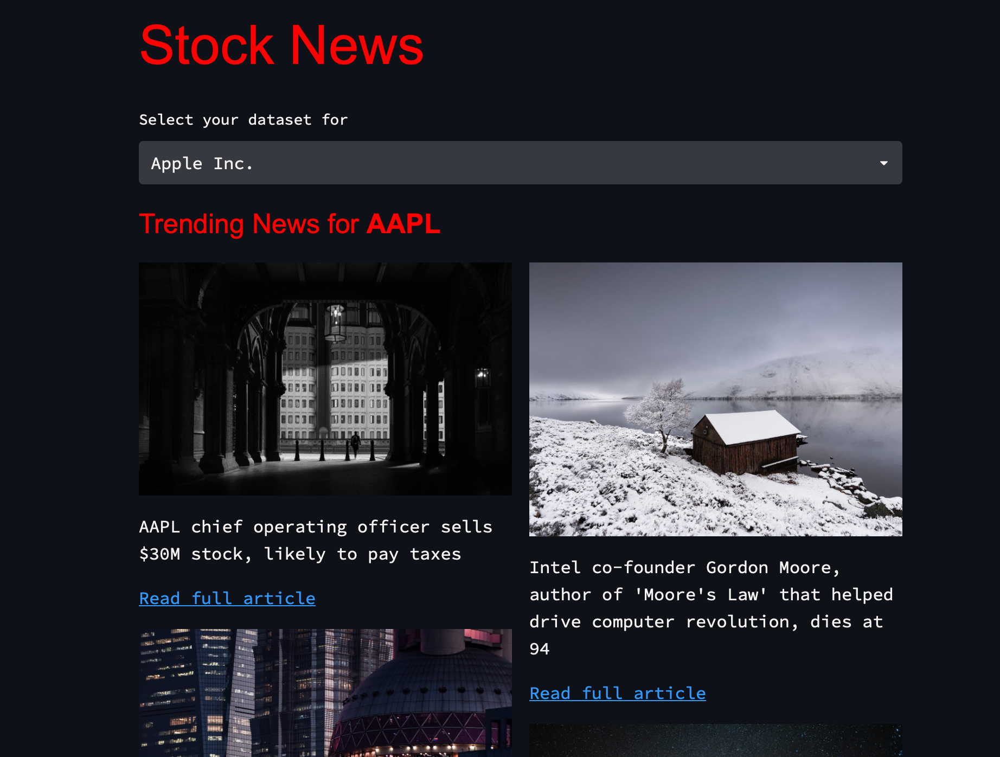
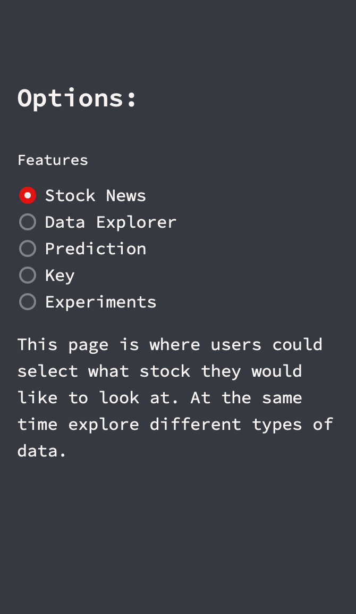
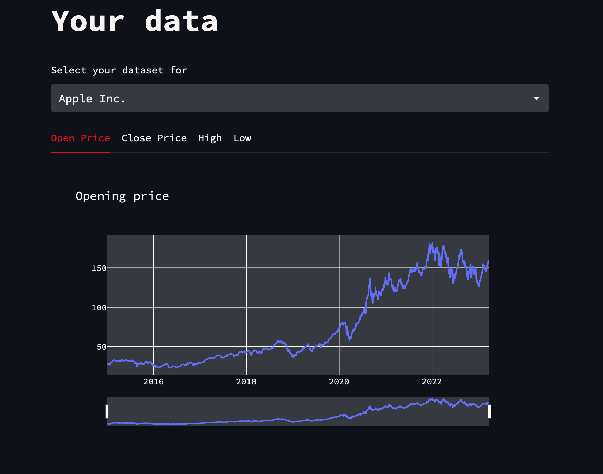
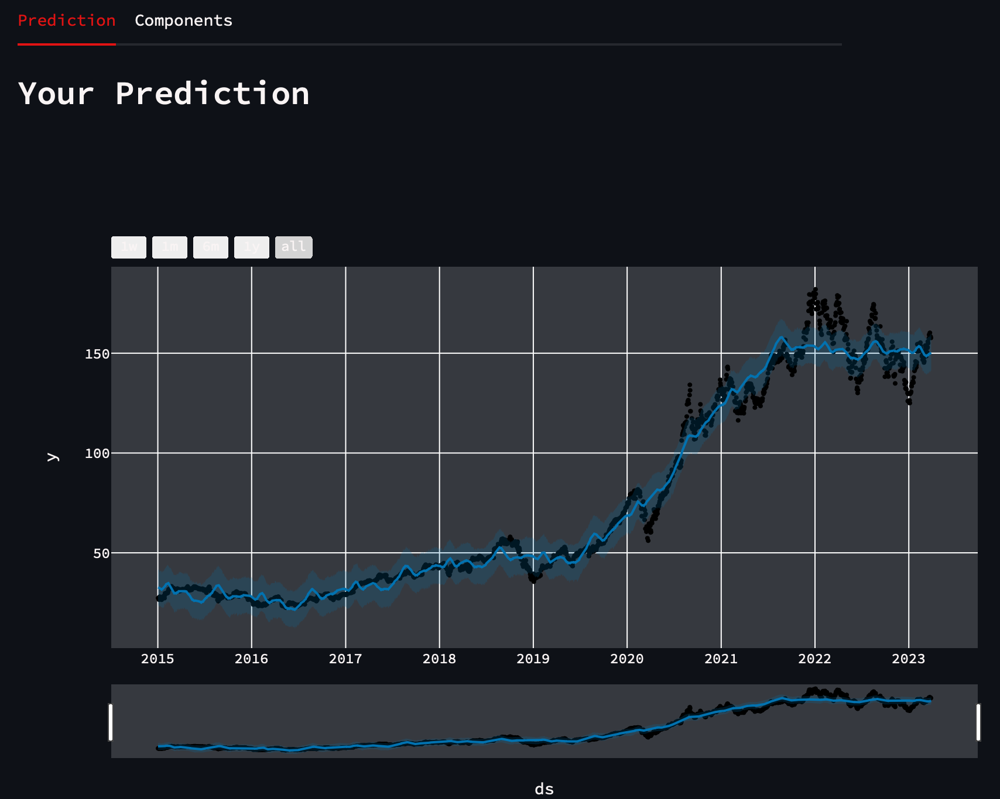
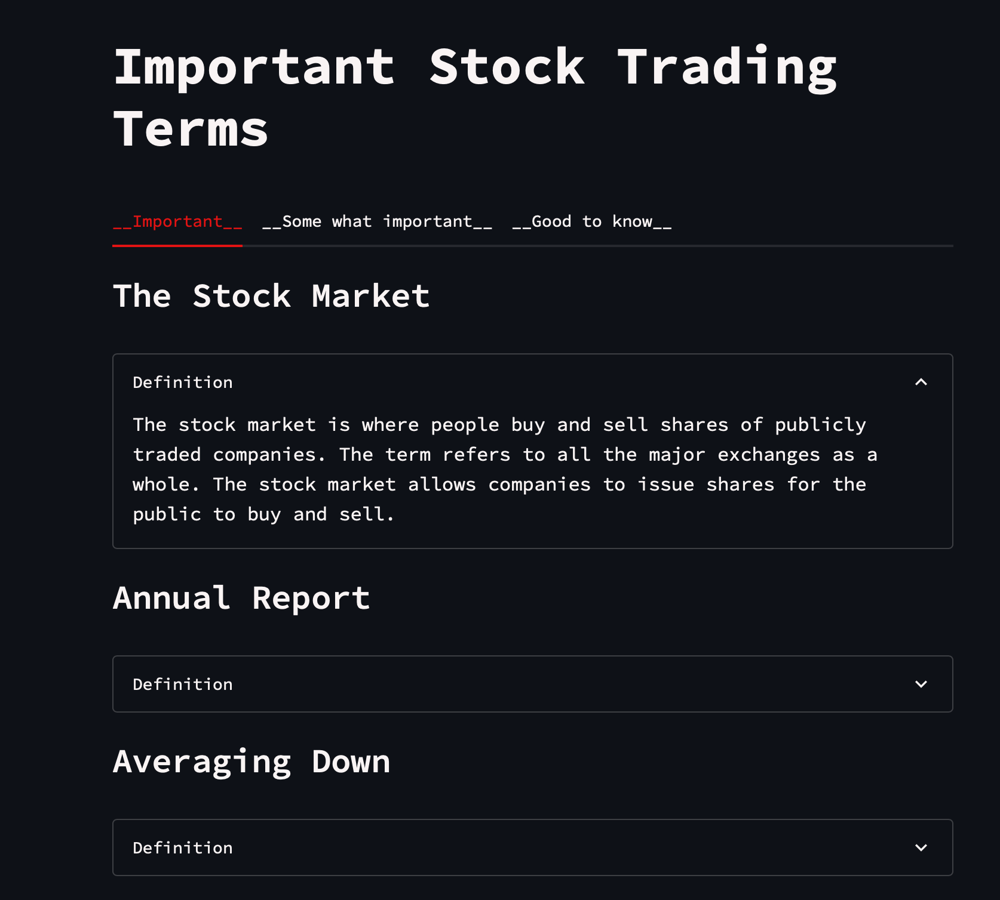
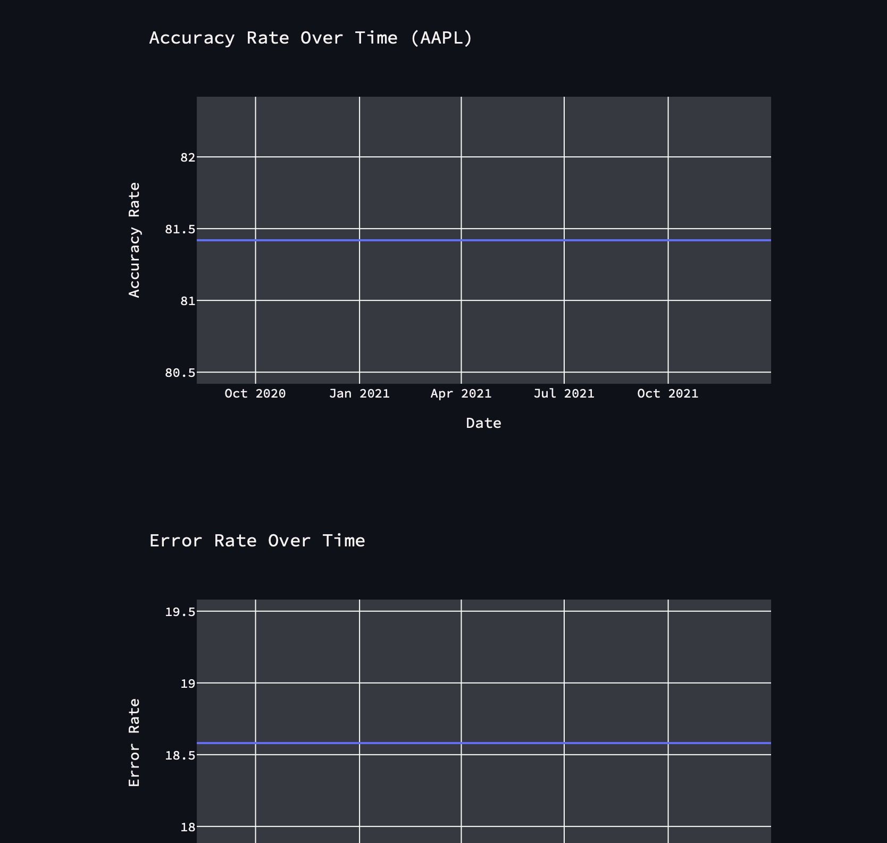
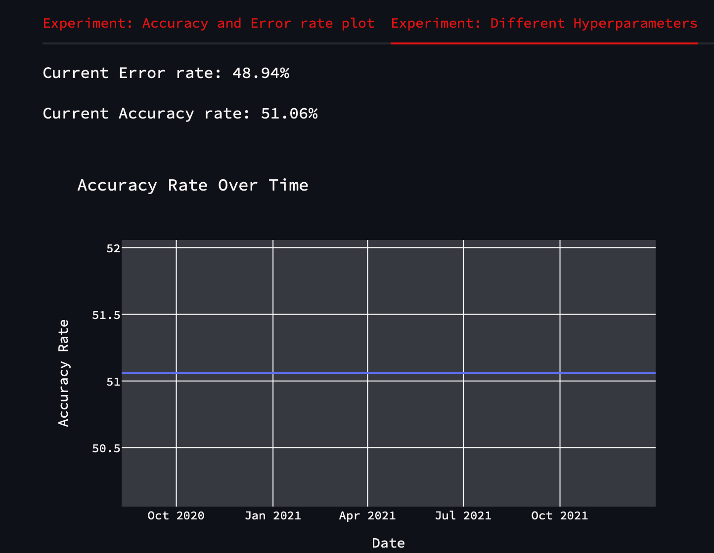

 
<p align="center">
  
</p>

# GatorStreet: The User-Friendly Machine Learning Tool for Mastering the Stock Market

# Table of Contents

1. [Abstract](##Abstraction)
2. [Intro](##Intro)
3. [Installation](##Installation )
4. [Output](##Output)

## Abstraction

GatorStreet is an open-source stock prediction tool that utilizes machine learning algorithms and artificial intelligence to provide up-to-date data on different aspects of the stock market, such as trends, volatility, and historical data. Its user-friendly web application design prioritizes simplicity and accessibility, making it an excellent resource for individuals with limited financial knowledge who want to learn and explore the stock market. In addition, the tool offers a risk-free environment for users to experiment with different investment strategies and make informed decisions about their future investment options.

## Intro

Are you tired of feeling overwhelmed and confused about the stock market? Do you want to learn how to make informed investment decisions but need help knowing where to start? Look no further than GatorStreet, the revolutionary educational stock sim that utilizes the power of machine learning and artificial intelligence to provide up-to-date data and insights into the complexities of the stock market.

GatorStreet isn't just another stock simulator - it's an innovative tool that empowers individuals with limited financial knowledge to learn and understand the stock market. Unlike traditional stock simulators that replicate the stock market, GatorStreet uses machine learning algorithms to analyze past stock data to simulate the stock market.

In a world where financial literacy is increasingly essential, GatorStreet provides a unique opportunity for individuals to learn about the stock market in a risk-free environment. So whether you're a beginner looking to learn the basics or an experienced investor looking to try new strategies, GatorStreet has something to offer. 

## Installation 

### Setting up a Virtual Environment
I recommend creating a virtual environment to manage dependencies. This ensures that the packages used by this project do not conflict with those of other projects.

To create a virtual environment, run the following command in your terminal:

```python -m venv <name_of_the_environment>```

To activate the virtual environment, run the following command:

```source <name_of_the_environment>/bin/activate```

To deactivate the virtual environment, simply run:

```deactivate```

### Installing Dependencies

Once you have activated your virtual environment, you can install the dependencies required for this project. To do so, run the following command:

```pip install -r requirements.txt```

### Running the Application

To run the application locally, navigate to the src directory in your terminal and run the following command:

```streamlit run main.py```

## Output

The GatorStreet application will guide you to a user-friendly web page that is designed to be easy to navigate. Here is a breakdown of the main features you can expect to see:

### Current News Page 

On the GatorStreet main page, you can use the stock selector on the sidebar to switch between different stocks and view the latest news articles related to the selected stock, as shown in the images below. The first image shows the stock selector on the sidebar, and the second image shows the latest news articles related to the selected stock.





### Sidebar
The sidebar contains buttons that allow you to access the different features of the application.




### Data Explorer

Click the ```Data Explorer``` button on the sidebar to explore your data. This feature displays information about a stock's open/close prices, as well as the high and low price of the stock.



### Stock Performance Prediction

To see the predicted performance of a selected stock, click the ```Prediction``` button on the sidebar. This feature displays a graph of the expected stock performance.




### Key

The ```Key``` feature contains financial definitions that are helpful to know.



The experiment feature locates the results of the experiment. The first experiment compares the Accuracy rate vs Error rate. 


### Experiment

The Experiment feature displays the results of two experiments.

The first experiment compares the Accuracy rate vs Error rate.

Accuracy vs Error rate (Experiment 1)



The second experiment tests the model using different hyperparameters (aka different periods).



